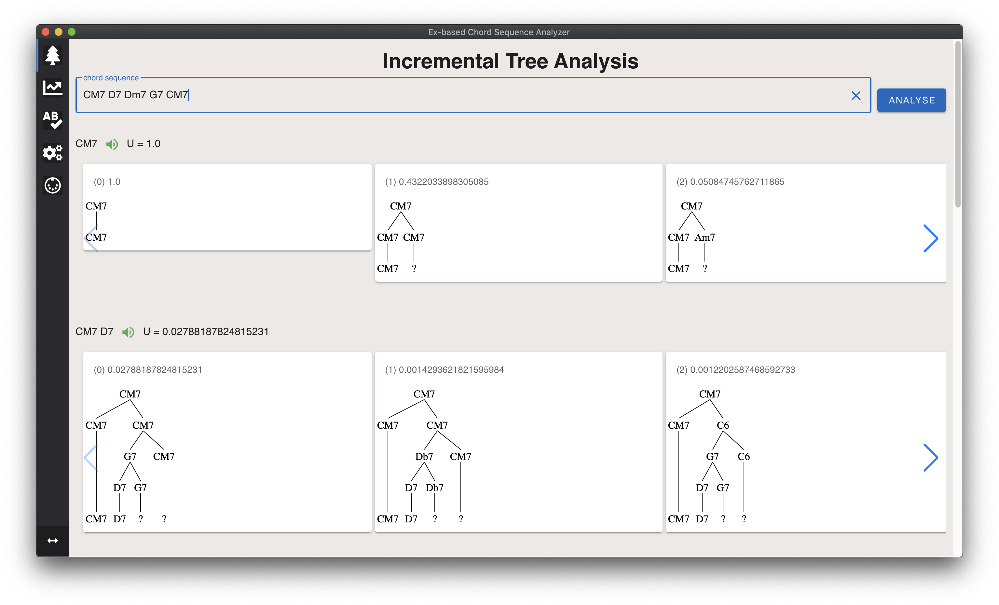

# Expectation-based Chord Sequence Analyzer(ECSA)
コード進行を漸進的に解して，楽曲途中の和声構造を表示するシステム
Visualize a harmonic structure in the middle of the song with incremental parsing

### Screen Shot



This system is implemented by electron-nuxt.

## Usage
In order to use this application, follow the following steps:

TODO

### for linux

### for mac

### for Windows


## Dependencies
- python3.x

## CUI Usage

#### Build Setup

``` bash
# install dependencies
yarn install

# serve app with hot reload
yarn run dev

# build electron application for production
yarn run build
```

## Licence

[MIT](https://github.com/tcnksm/tool/blob/master/LICENCE)

## Reference
[[1]](https://smc2020torino.it/adminupload/file/SMCCIM_2020_paper_111.pdf) Yuta Ogura, Hidefumi Ohmura, Yui Uehara, Hidefumi Tojo, and Kouichi Katsurada.
Expectation-based parsing for jazz chord sequences. In Proceedings of the 17th Sound
and Music Computing Conference, pp. 350-356, 2020.


## 自分用のメモ
### git
.gitignore を後から追加
- ファイル削除
  ``` git rm hogehoge.txt ```
- キャッシュ削除
  ``` git rm --cached hogehoge.txt ```

Gitではそもそも空っぽのディレクトリ単体は追跡できないため，```py/linegraph ``` には空ファイルの```.keep```を含めている．

---

This project was generated with [electron-nuxt](https://github.com/michalzaq12/electron-nuxt) v1.6.0 using [vue-cli](https://github.com/vuejs/vue-cli). Documentation about the original structure can be found [here](https://github.com/michalzaq12/electron-nuxt/blob/master/README.md).
